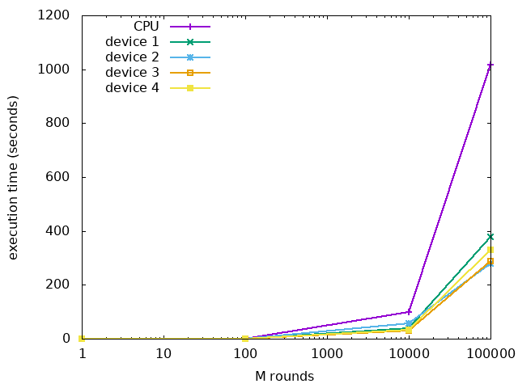

# CA Project

<h3 align=right> 309510133 - Cheng-Cheng Lo </h3>

[TOC]

## 題目

康威生命遊戲 (Conway's Game of Life)

## 檔案說明

* readme.txt: 本檔案，使用 Markdown 語法
* main.cu: 包含 main function、設定初始值、顯示結果等
* host.h: 使用 CPU 順序得運算，用於和 GPU 版本程式比較速度
* device1.cu: 使用 GPU 平行運算的版本，不同切割方式的說明見下面的小節
* device2.cu: 使用 GPU 平行運算的版本，不同切割方式的說明見下面的小節
* device3.cu: 使用 GPU 平行運算的版本，不同切割方式的說明見下面的小節
* device4.cu: 使用 GPU 平行運算的版本，不同切割方式的說明見下面的小節

## 環境

### 使用的電腦

* 20.04.1 LTS (Focal Fossa)
* nvcc release 10.1, V10.1.243
* CPU: Intel i7-7700 CPU @ 3.60GHz
* GPU: Nvidia GeForce GTX 1050

### 編譯與執行

根據下面幾種情況其中一種選擇輸入的指令。

```bash
# compute by CPU
# comment runGPUSimulations and uncomment runSimulations in main()
$ nvcc main.cu

# compute by GPU with different ways of splitting data
$ nvcc main.cu device1.cu
$ nvcc main.cu device2.cu
$ nvcc main.cu device3.cu
$ nvcc main.cu device4.cu
```

不論哪一種都會產生 `a.out` 檔案，透過下面指令執行並印出結果。

```bash
$ ./a.out
```

## 演算法內容

在二維矩形的世界中，每個方格住著一個細胞，細胞處於活著或死去其中一個狀態。下一個時刻細胞的死活由這一時刻它周圍的 8 個細胞所決定，規則如下:

* 目前細胞為存活狀態，周圍有 2 個 或 3 個活細胞: 細胞維持存活
* 目前細胞為存活狀態，周圍有小於 2 個 或大於 3 個活細胞: 細胞死去
* 目前細胞為死亡狀態，周圍恰有 3 個活細胞: 細胞存活
* 目前細胞為死亡狀態，周圍活細胞數量不為 3: 細胞維持死去

若將上述規則畫成有限狀態機:


在這個專題中，我的程式模擬了 M 回合後細胞的狀態。並採用 4 種不同切割資料的方式。

## 切割方式

這裡實做了四種分割方式，這裡以 8x8 的二維矩形世界為例，grid 和 block 大小都是 2。不同顏色代表分別由不同的 thread 處理。


雖然這裡用二維矩陣繪圖，但實做是使用一維陣列，原本二維矩陣對應的 i, j 經變換後對應到一維陣列。如果將其繪出會是以下樣子。這裡只畫前 16 個。另外，在實做時，我在二維矩形外有加一圈邊邊，其細胞狀態一直都維持死亡，不用更新他的狀態，這樣原本邊邊角角的細胞才不用做特殊處理，這裡沒特別畫出這個部份。


## 模擬結果

### 結果比較

我嘗試比較以不同切割方式實做和跑 M 個回合時所花的時間。

下表的時間是用 Linux 指令 `time` 所顯示之 total 時間 (`time ./a.out`)，單位都是「秒」。方格大小設為 1000x1000，每個 grid 所含 block 數量和每個 block 所含 thread 數量都是 10。表中 N/A 表示計算時間過久 (超過 5 分鐘)，

| M rounds |  CPU   | device1 | device2 | device3 | device4 |
| :------: | :----: | :-----: | :-----: | :-----: | :-----: |
|    1     | 0.032  |  0.186  |  0.266  |  0.238  |  0.148  |
|   100    | 1.083  |  0.647  |  0.150  |  0.502  |  0.542  |
|  10000   | 99.840 | 37.733  |  0.568  | 29.126  | 32.878  |
|  100000  |  N/A   | 377.650 |  2.500  | 287.550 | 330.620 |
| 1000000  |  N/A   |   N/A   | 22.501  |   N/A   |   N/A   |



從上表和圖我歸納出幾個結論:

* 當計算量不大時 (M 很小時)，CPU 計算所花的總時間比使用 GPU 還短，這可能是因為 CPU 單一運算能力原本就比 GPU 強，而且從 host 複製記憶體到 device 再搬移回來也需要時間。
* 但當 M 逐漸變大時，GPU 的優勢便展現了，在這種計算密集的應用裡，使用 GPU 能大幅縮短運算時間。
* 不同的資料切割方式對時間有很大的影響，表中的 device2 的計算時間比其他方式還短很多。
* 4 種不同切割方式，若以執行時間為唯一標準，其優劣為 device 2 > device 3 > device 4 > device1。

